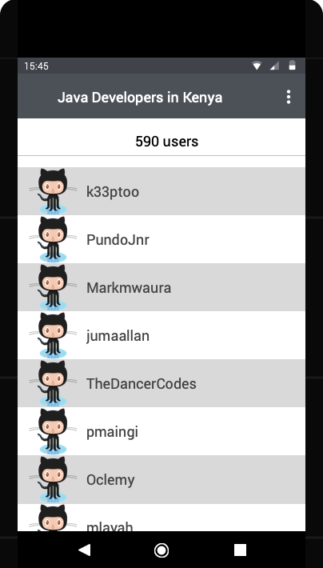
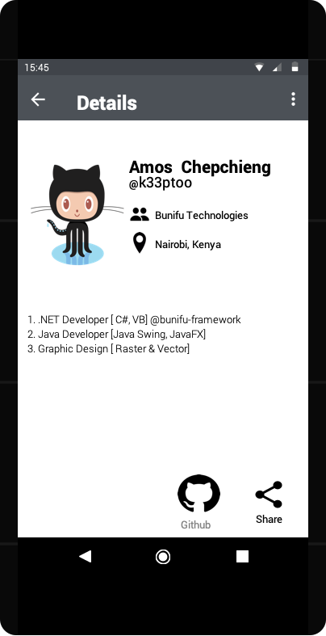

# github_codelab
An android app to list Java developers in Nairobi.

## Online mockups
Navigable wireframes for the app are available [here](https://www.justinmind.com/usernote/tests/39795439/39821490/39821492/index.html)

### Screenshots
#### Main screen
This will display a list of java developers in Kenya showing their profile pictures along with their usernames.

#### Detail Page
This will display more details about the selected user. Github's user detail API may be queried to get more details as the search API doesn't provide all details.

### Prototyping Tool used
Wireframes for the codelab were designed using the JustinMind prototyping tool

#### Justification for tool
- It's a free resource that requires no subscriptions.
- Has a wide selection of tools and components to ease the prototyping process.
- Available for offline use which makes it a more flexible tool to work with.
