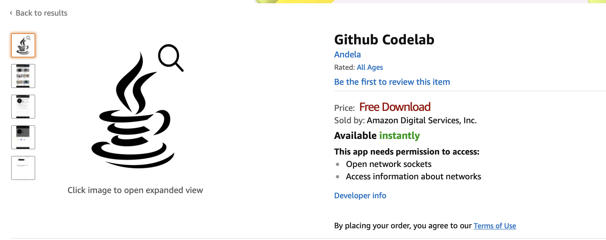
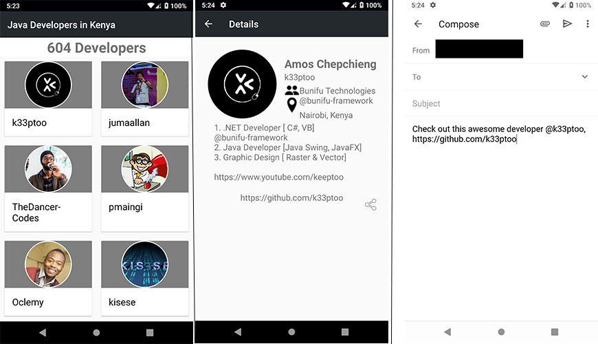
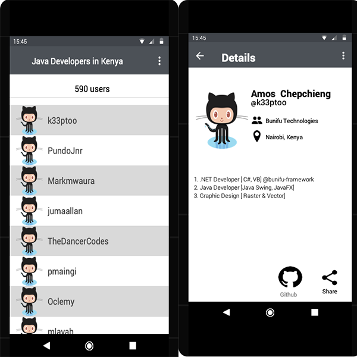

# Github Codelab
An android app to list Java developers in Nairobi.

[](https://travis-ci.org/mubstimor/github_codelab) [](https://codeclimate.com/github/mubstimor/github_codelab/maintainability) [](https://codecov.io/gh/mubstimor/github_codelab)

## Amazon App store
The app is available for download from the Amazon app store [here](https://www.amazon.com/dp/B07QLJCRWT/ref=sr_1_1?keywords=Github+codelab&qid=1555318889&s=gateway&sr=8-1-spell)



## Screenshots


## Project setup
This project consists of a single Gradle-based project

It has three main directories inside the app/src folder
* /main - The Android application
* /androidTest - UI tests for the app with Espresso
* /test - Unit tests for the project with Roboelectric

Espresso tests can be run using:
~~~~
./gradlew connectedCheck
./gradlew connectedAndroidTest
~~~~

JUnit and Robolectric tests can be run using one of the following:
~~~~
./gradlew test
./gradlew check
./gradlew build
~~~~

Test just runs the tests, check would run tests plus checkstyle, lint etc, and build compiles everything & checks & tests

## Online mockups
Navigable wireframes for the app are available [here](https://www.justinmind.com/usernote/tests/39795439/39821490/39821492/index.html)

### Original mockups
Below is the mockup on which the project initiation was based.



### Prototyping Tool used
Wireframes for the codelab were designed using the JustinMind prototyping tool

#### Justification for tool
- It's a free resource that requires no subscriptions.
- Has a wide selection of tools and components to ease the prototyping process.
- Available for offline use which makes it a more flexible tool to work with.

#### Fastlane integration
Fastlane automates the release of the product by uploading the apk to the slack channel.
- Setup environment variables with
```
export SLACK_URL="..."
export SLACK_API_TOKEN="..."
export SLACK_CHANNEL="..."
```
Run with
```
fastlane slackbuild
```